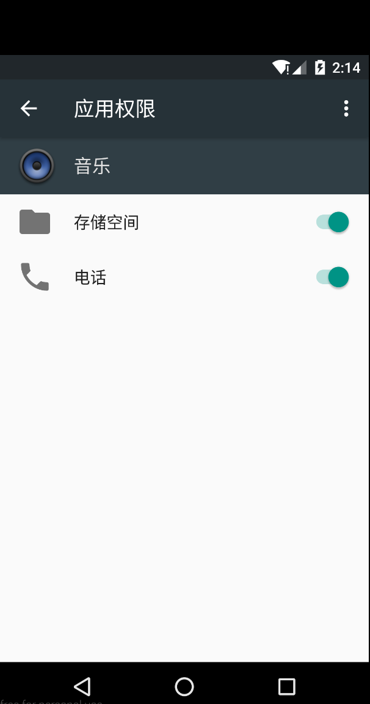
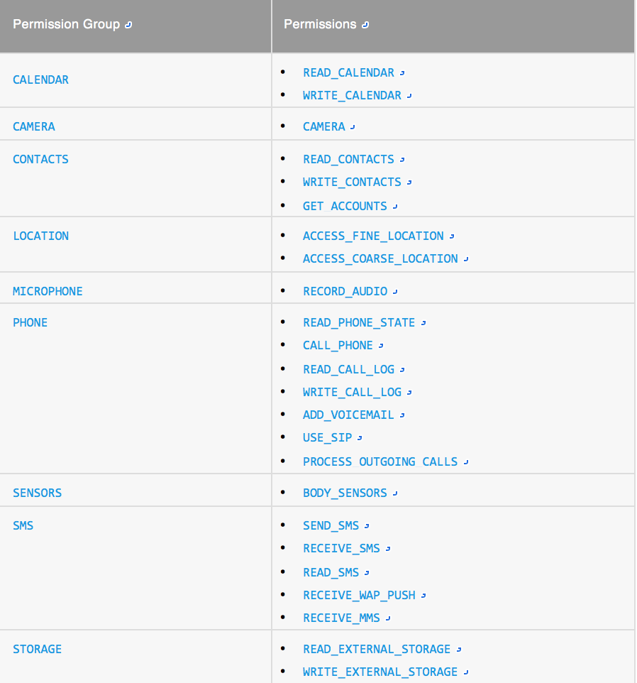

# 6.0运行时权限管理方案

## 1. 概述

### 1.1 6.0的权限系统变化

Android系统在API 23对权限管理系统进行了颠覆性的改变：

* 在6.0之前，在安装APP时，用户必须同意app在Manifest中生命的所有权限
* 6.0，Android敏感权限由用户在运行时授予并且可以在设置界面取消权限
   * 若targetSdkVersion设置为**>=23**，在6.0的设备上，使用到敏感权限的时候时， 应该手动弹出权限对话框，如果不弹出，则直接Crash
   * 在6.0的设备上，用户可以取消权限设置
      * 如果若targetSdkVersion设置为>23,使用敏感权限不询问会导致Crash
      * 若targetSdkVersion设置为<=23，仍旧使用老的权限系统，但是用户仍然可以在设置中取消特定权限的授权，这种情况下使用敏感权限不询问，则什么都不干；如果逻辑不严谨，可能因为逻辑问题导致Crash
   * 6.0版本权限按组进行分配，如果分配了一组权限中的一个，则其他权限同样被分配

<center>

<br/>
<i>解除、赋予权限界面</i>

</center>

### 1.2 非敏感权限(PROTECTION_NORMAL)

非敏感权限不会对用户的隐私产生破坏。Android系统不对非敏感权限进行提示并且不允许对非敏感权限进行取消操作，但是仍需要在Manifest中声明，Android的非敏感权限如下：

* ACCESS_LOCATION_EXTRA_COMMANDS
* ACCESS_NETWORK_STATE
* ACCESS_NOTIFICATION_POLICY
* ACCESS_WIFI_STATE
* BLUETOOTH
* BLUETOOTH_ADMIN
* BROADCAST_STICKY
* CHANGE_NETWORK_STATE
* CHANGE_WIFI_MULTICAST_STATE
* CHANGE_WIFI_STATE
* DISABLE_KEYGUARD
* EXPAND_STATUS_BAR
* GET_PACKAGE_SIZE
* INSTALL_SHORTCUT
* INTERNET
* KILL_BACKGROUND_PROCESSES
* MODIFY_AUDIO_SETTINGS
* NFC
* READ_SYNC_SETTINGS
* READ_SYNC_STATS
* RECEIVE_BOOT_COMPLETED
* REORDER_TASKS
* REQUEST_IGNORE_BATTERY_OPTIMIZATIONS
* REQUEST_INSTALL_PACKAGES
* SET_ALARM
* SET_TIME_ZONE
* SET_WALLPAPER
* SET_WALLPAPER_HINTS
* TRANSMIT_IR
* UNINSTALL_SHORTCUT
* USE_FINGERPRINT
* VIBRATE
* WAKE_LOCK
* WRITE_SYNC_SETTINGS

非敏感权限引用:[Normal Permissions](https://developer.android.com/guide/topics/security/normal-permissions.html)

### 1.3 敏感权限

引用：[Dangerous permissions and permission groups](https://developer.android.com/guide/topics/security/permissions.html#defining)

如果设备正在运行Android 5.1(API级别22)或更低,或应用的targetSdkVersion 22或更低,系统要求用户在安装时授予所有的权限。

敏感权限有可能会泄露用户的隐私，所以在**targetSdkVersion >= 23**的App中需要用户在运行时赋予特定的权限。

API 23版本的敏感权限以及分组的信息如下：



## 2. 实现

### 2.1 思路

在尽量少的改动现有代码的基础上，添加运行时权限管理相关代码：

* 封装进行运行时权限管理代码的逻辑(PermissionChecker)
* 因为App中所有的Activity都继承自BaseActivity,而所有的Fragment都继承自BaseFragment，所以可以在这两个类上添加相关代码
* 通过Callback的方式，让实现类(具体的Activity或者Fragment)实现授权通过和拒绝的逻辑


### 2.2 权限相关系统API

API 23提供的权限相关的API：

```
// 检查是否具有指定权限
checkSelfPermission(permission_name);
ContextCompat.checkSelfPermission(context, permission);

// 检查能否弹出权限对话框，在6.0之前版本调用，永远返回false。
shouldShowRequestPermissionRationale(permission_name);
ActivityCompat.shouldShowRequestPermissionRationale(activity,permission);
            

// 请求权限，这个方法在6.0之前版本调用，OnRequestPermissionsResultCallback直接被调用
requestPermissions(permission_name[],request_code);
ActivityCompat.requestPermissions(activity,npermission_name[],request_code);

// Fragment&Activity权限申请的回调方法，无论是拒绝还是同意
onRequestPermissionsResult(
	int requestCode,String[] permissions,int[] grantResults)

```

### 2.3 权限检测一般步骤

```
// Here, thisActivity is the current activity 
if (ContextCompat.checkSelfPermission(thisActivity,
                Manifest.permission.READ_CONTACTS) 
        != PackageManager.PERMISSION_GRANTED) {
 
    // Should we show an explanation? 
    if (ActivityCompat.shouldShowRequestPermissionRationale(thisActivity,
            Manifest.permission.READ_CONTACTS)) { 
 
        // Show an expanation to the user *asynchronously* -- don't block 
        // this thread waiting for the user's response! After the user 
        // sees the explanation, try again to request the permission. 
 
    } else { 
 
        // No explanation needed, we can request the permission. 
 
        ActivityCompat.requestPermissions(thisActivity,
                new String[]{Manifest.permission.READ_CONTACTS},
                MY_PERMISSIONS_REQUEST_READ_CONTACTS); 
 
        // MY_PERMISSIONS_REQUEST_READ_CONTACTS is an 
        // app-defined int constant. The callback method gets the 
        // result of the request. 
    } 
} 
```

### 2.4 实现（Demo）

PermissionChecker.java

```
/**
 * 权限检查器
 */
public class PermissionChecker {

    private static final int REEQUEST_PERMISSION_BY_ACTIVITY = 0x1001;
    private static final int REEQUEST_PERMISSION_BY_FRAGMENT = 0x2001;

    private PermissionChecker(){

    }

    // 创建检查器实例
    public static PermissionChecker create(){
        return new PermissionChecker();
    }

    // 检查回调
    private CheckerCallback mCheckerCallback;

    public void check(final BaseActivity activity,
                      final PermissionBean permissionBean, CheckerCallback callback){
        mCheckerCallback = callback;
        activity.setPermissionChecker(this);

        // 是否已经granted
        int granted = ContextCompat.checkSelfPermission(activity, permissionBean.getPermission());

        if(granted != PackageManager.PERMISSION_GRANTED){

            // 是否需要显示权限对话框
            boolean shouldShow = ActivityCompat.shouldShowRequestPermissionRationale(
                    activity,permissionBean.getPermission());

            if(shouldShow){
                // 提示用户需要XXX权限
                showMessageOKCancel(activity,
                        permissionBean.getPermissionRationale(),
                        new DialogInterface.OnClickListener(){

                            @Override
                            public void onClick(DialogInterface dialogInterface, int i) {
                                // 请求权限
                                ActivityCompat.requestPermissions(activity,
                                        new String[] {permissionBean.getPermission()}
                                        ,REEQUEST_PERMISSION_BY_ACTIVITY);
                            }
                        },new DialogInterface.OnClickListener(){

                            @Override
                            public void onClick(DialogInterface dialogInterface, int i) {
                                mCheckerCallback.onDenied(permissionBean.getPermission());
                            }
                        }
                );
                return;
            }
            // 请求权限
            ActivityCompat.requestPermissions(activity,new String[] {
                    permissionBean.getPermission()},REEQUEST_PERMISSION_BY_ACTIVITY);
        }else{
            mCheckerCallback.onGranted(permissionBean.getPermission());
        }
    }
    
    public void check(final BaseFragment fragment,
                      final PermissionBean permissionBean, CheckerCallback callback){
        mCheckerCallback = callback;
        fragment.setPermissionChecker(this);
        
        int granted = ContextCompat.checkSelfPermission(fragment.getContext(), 
        			permissionBean.getPermission());
        
        if(granted != PackageManager.PERMISSION_GRANTED){

            boolean shouldShow = ActivityCompat.shouldShowRequestPermissionRationale(
            			fragment.getActivity(),
            			permissionBean.getPermission());
            			
            if(shouldShow){

                showMessageOKCancel(fragment.getActivity(),permissionBean.getPermissionRationale(),
                        new DialogInterface.OnClickListener(){

                            @Override
                            public void onClick(DialogInterface dialogInterface, int i) {
                                fragment.requestPermissions(
                                		new String[] {permissionBean.getPermission()},
                                		REEQUEST_PERMISSION_BY_FRAGMENT);
                            }
                        },new DialogInterface.OnClickListener(){

                            @Override
                            public void onClick(DialogInterface dialogInterface, int i) {
                                mCheckerCallback.onDenied(permissionBean.getPermission());
                            }
                        });
                return;
            }
            fragment.requestPermissions(
            			new String[] {permissionBean.getPermission()},
            			REEQUEST_PERMISSION_BY_FRAGMENT);
        }else{
            mCheckerCallback.onGranted(permissionBean.getPermission());
        }
    }

    private void showMessageOKCancel(Activity activity, String message,
                                     DialogInterface.OnClickListener okListener,
                                     DialogInterface.OnClickListener cancelListener) {
        new AlertDialog.Builder(activity)
                .setMessage(message)
                .setPositiveButton("OK", okListener)
                .setNegativeButton("Cancel", cancelListener)
                .create()
                .show();
    }

    public void onRequestPermissionsResult(int requestCode, String[] permissions, int[] grantResults) {

        if(null == mCheckerCallback || null == permissions || null == grantResults){
            return;
        }

        if(permissions.length == 1 && grantResults.length == 1){
            if(PackageManager.PERMISSION_GRANTED == grantResults[0]){
                mCheckerCallback.onGranted(permissions[0]);
            }else{
                mCheckerCallback.onDenied(permissions[0]);
            }
        }
        
        // 多权限请求逻辑

    }

    public interface CheckerCallback{
        void onGranted(String permission);
        void onDenied(String permission);
    }

    public static class SingleCheckCallback implements  CheckerCallback{

        @Override
        public void onGranted(String permission) {

        }

        @Override
        public void onDenied(String permission) {

        }

    }
}
```

PermissionBean.java

```
package com.yx.permission;

import android.content.pm.PackageManager;
import android.support.annotation.IntDef;
import android.support.annotation.NonNull;

/**
 * 权限字段
 */
public class PermissionBean {

    /** 权限字段 **/
    private String permission;

    /** 授权结果 **/
    @IntDef({PackageManager.PERMISSION_GRANTED,PackageManager.PERMISSION_DENIED})
    public @interface GrantdResult{

    }

    private int grantdResult;
    /** 让用户给予这个权限的理由 **/
    private String permissionRationale;

    public String getPermission() {
        return permission;
    }

    public void setPermission(@NonNull String permission) {
        this.permission = permission;
    }

    @GrantdResult
    public int getGrantdResult() {
        return grantdResult;
    }

    public void setGrantdResult(@GrantdResult int grantdResult) {
        this.grantdResult = grantdResult;
    }

    public String getPermissionRationale() {
        return permissionRationale;
    }


    public void setPermissionRationale(@NonNull String permissionRationale) {
        this.permissionRationale = permissionRationale;
    }

}
```

使用示例:

```
PermissionBean bean = new PermissionBean();
bean.setPermission(Manifest.permission.ACCESS_COARSE_LOCATION);
bean.setPermissionRationale("有信需要读取您的设备信息");

PermissionChecker.create().check(this,bean,
        new PermissionChecker.SingleCheckCallback() {
    @Override
    public void onGranted(String permission) {
        YulorePageConfiguration build = new YulorePageConfiguration.Builder()
                .apiKey(Resource.DIAN_HUA_BANG_API_KEY)
                .apiSecret(Resource.DIAN_HUA_BANG_API_SECRET)
                .build(getApplicationContext());
        ApplicationMap.getInstance().init(build);
    }

    @Override
    public void onDenied(String permission) {
        finish();
    }
});
```

### 2.5 注意点

* 因为6.0版本之后，敏感权限较多，对业务逻辑代码的侵入性较大，可能造成对代码稳定性、逻辑完整性的破坏
* 部分在Application中进行的初始化，需要在类似Splash界面或者在使用到具体业务代码的时候再申请权限
* 有些第三方的SDK的初始化，最好在使用到具体业务模块的时候再进行初始化(第三方内部可能使用了比较敏感的权限)
* 运行时权限系统的加入会降低代码的可读性
* 上面的Demo中并没有加入多个权限的情况(需要考虑A被授权、B被拒绝的情况)

## 3.其他解决方案

开源项目[PermissionsDispatcher](https://github.com/hotchemi/PermissionsDispatcher)以注解的方式减少权限检查的业务代码

## 4.参考

* [Requesting Permissions at Run Time](https://developer.android.com/training/permissions/requesting.html#perm-check)
* [System Permissions](https://developer.android.com/guide/topics/security/permissions.html#defining)
* [Normal Permissions](https://developer.android.com/guide/topics/security/normal-permissions.html)
* [PermissionsDispatcher](https://github.com/hotchemi/PermissionsDispatcher)


