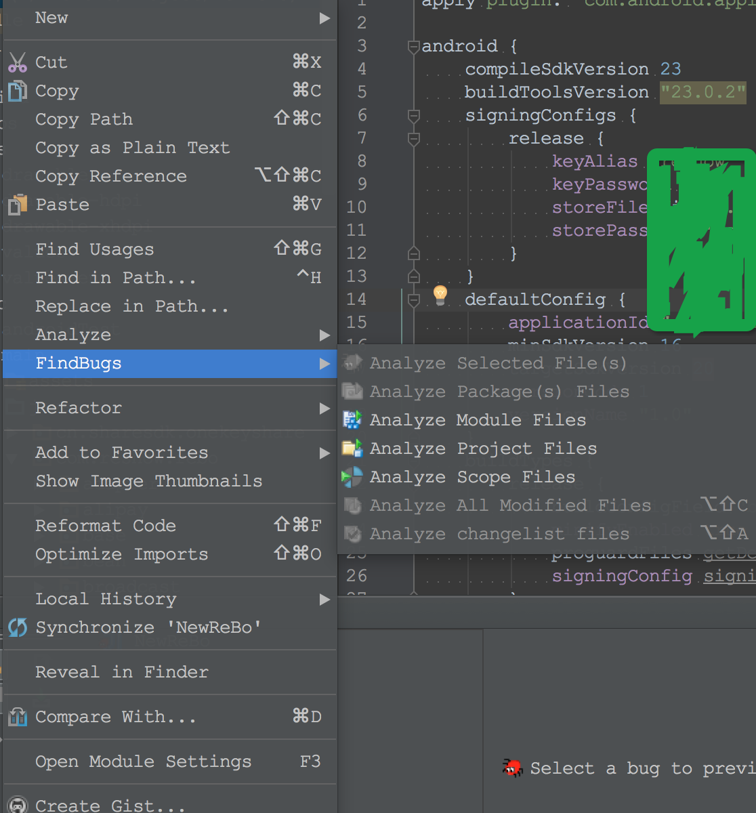

# AndroidStudio使用FindBugs进行静态代码分析

来源：[Static Code Analysis using FindBugs (Android Studio)](https://androidbycode.wordpress.com/2015/02/13/static-code-analysis-automation-using-findbugs-android-studio/)

有很多技术、手段以及工具可以改进你的团队的代码质量。静态代码分析是其中之一，如果您使用的是AndroidStudio，您可能已经使用过至少一个工具——Android Lint。Lint是一个非常高效的工具，它不仅仅检查Java源代码，还会检查XML文件，包括layout等。它应该是Android开发静态代码检查的第一站。

FindBugs不是用来替换Lint的工具，它被当做Lint的一个补充。它是一个开源静态分析工具，它执行你的Java字节码，以警告潜在的错误，缺陷，安全和性能问题。它不知道Android的不良设计，也不是万能的，但它可以提供在软件中的潜在问题的调整建议。它永远不会有100％的命中率，但它允许开发人员改变一段代码为另一种实现。


当一个问题产生，你会得到以下九种不同的一个警告。它们是：

* Dodgy code:狡猾的，容易产生问题的代码
* Malicious code vulnerability:可能遭受恶意攻击的代码
* Bad practice:不良编程习惯，坏的实现
* Correctness:代码不正确,逻辑有问题，如NullPointerException
* Internationalization:国际化问题
* Security:安全性问题
* Performance:性能问题
* Multi-threaded correctness:多线程安全问题
* Experimental:实验性质的代码

以上每一种情况都可以被禁用，你也可以配置那些级别的问题可以被上报。

## AndroidStudio安装FindBugs

AndroidStudio --> Preferences --> Plugin --> 搜索FindBugs --> 安装FindBugs，然后重启


## 执行FindBugs分析

在执行FindBugs分析之前代码必须编译为Class文件，然后可以通过在Project或者Module上右击选择**Analyze**或者**FindBugs**执行分析



## FindBugs过滤器


在第一次运行FindBugs的时候你可能会对结果相当失望。默认的设置没有过滤器设置，FindBugs将报告许多问题。例如,您可能会得到许多类似于这些警告:

```
The class name R$dimen doesn't start with an upper case letter
The class name R$drawable doesn't start with an upper case letter
```


[FindBugs的过滤器设置文档](http://findbugs.sourceforge.net/manual/filter.html)，详细说明了如何创建一个排除过滤器。下面的设置排除Android的自动生成的代码的警告：

```
<?xml version="1.0" encoding="UTF-8"?>
<FindBugsFilter>
    <Match>
        <!-- ignore all issues in resource generation -->
        <Class name="~.*\.R\$.*"/>
    </Match>
    <Match>
        <Class name="~.*\.Manifest\$.*"/>
    </Match>
</FindBugsFilter>
```

编写完上面的xml文件之后，再通过"AndroidStudio-->Preferences-->Other Settings-->FindBugs-IDEA-->Filter-->Exclude filter files"增加这个文件即可


## 自动化FindBugs

可以在Android开发中自动执行FindBugs分析，可以按照以下的方式添加一个gradle任务:

```
apply plugin: 'findbugs'
 
task findbugs(type: FindBugs) {
    ignoreFailures = false
    effort = "default"
    reportLevel = "medium"
    excludeFilter = new File("${project.rootDir}/findbugs/findbugs-filter.xml")
    classes = files("${project.rootDir}/app/build/intermediates/classes")
    source = fileTree('src/main/java/')
    classpath = files()
    reports {
        xml.enabled = true
        html.enabled = true
        xml {
            destination "$project.buildDir/findbugs/findbugs-output.xml"
        }
        html {
            destination "$project.buildDir/findbugs/findbugs-output.html"
        }
    }
}
```

[gradle对FindBugs的支持](https://docs.gradle.org/current/userguide/findbugs_plugin.html),可以访问[https://docs.gradle.org/current/dsl/org.gradle.api.plugins.quality.FindBugs.html](https://docs.gradle.org/current/dsl/org.gradle.api.plugins.quality.FindBugs.html)获取更多的信息

## 总结

FindBugs是你的代码质量的第一道防线。

## 引用

* FindBugs home [http://findbugs.sourceforge.net/](http://findbugs.sourceforge.net/)

* FindBugs Intellij Plugin [https://plugins.jetbrains.com/plugin/3847?pr=idea](https://plugins.jetbrains.com/plugin/3847?pr=idea)

* Gradle FindBugs Plugin [https://gradle.org/docs/current/userguide/findbugs_plugin.html](https://gradle.org/docs/current/userguide/findbugs_plugin.html)

* FindBugs Bug列表:[http://findbugs.sourceforge.net/bugDescriptions.html#BC_EQUALS_METHOD_SHOULD_WORK_FOR_ALL_OBJECTS](http://findbugs.sourceforge.net/bugDescriptions.html#BC_EQUALS_METHOD_SHOULD_WORK_FOR_ALL_OBJECTS)

*  FindBugs 过滤设置:[http://findbugs.sourceforge.net/manual/filter.html](http://findbugs.sourceforge.net/manual/filter.html)


