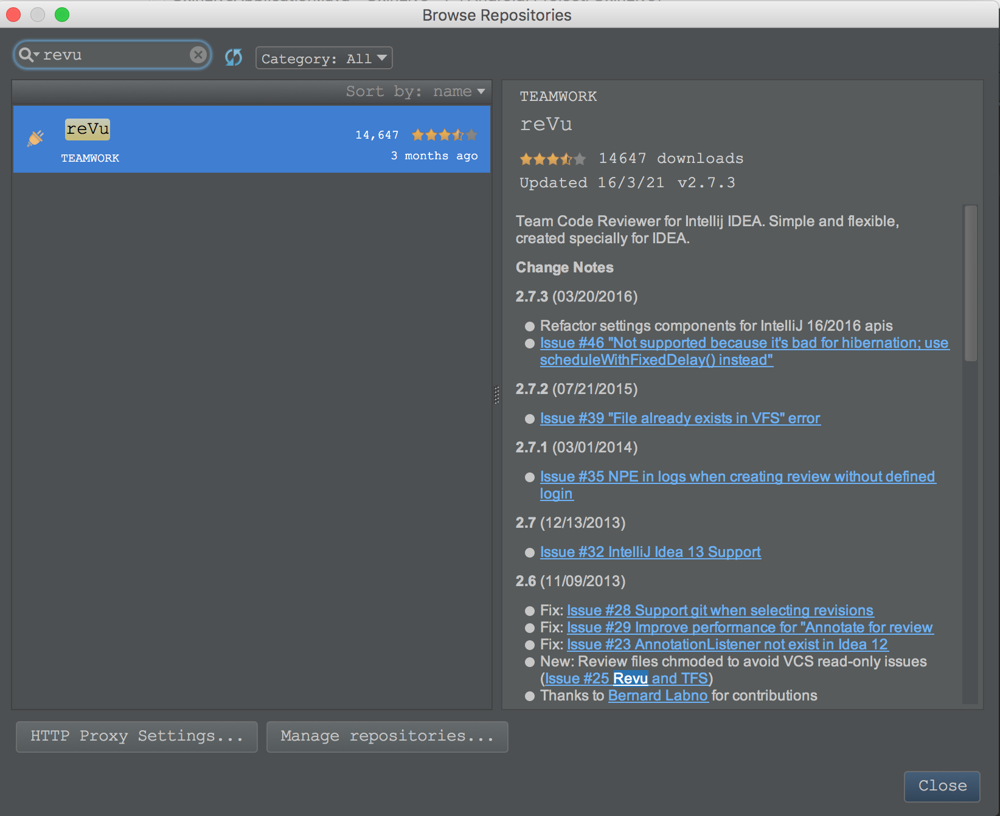
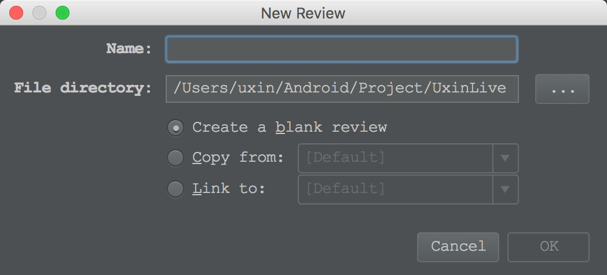
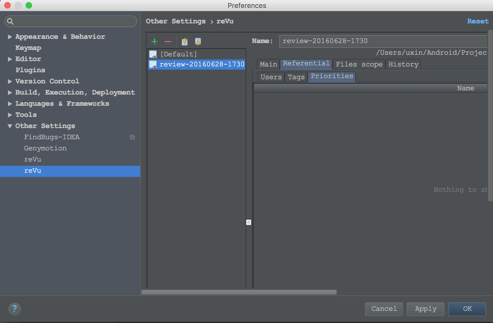
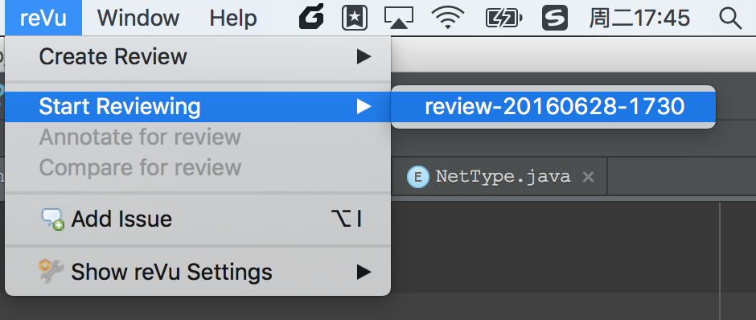
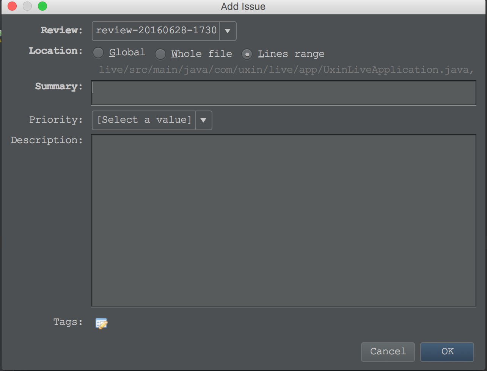
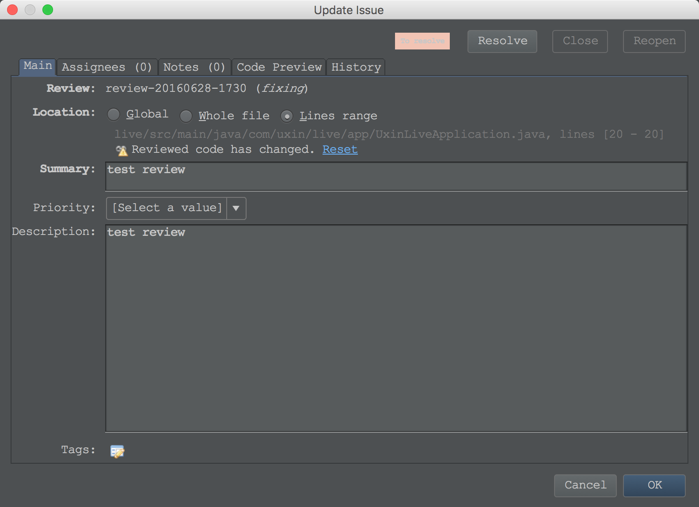
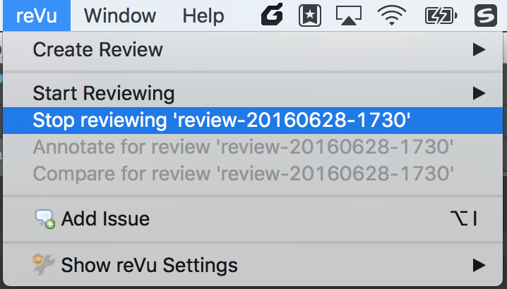

# reVu的安装和使用

## 1.安装

AndroidStudio --> Preferences --> Plugins --> 搜索框输入"reVu"进行搜索--> install --> 重启Android Studio --> 如果安装成功，可以在菜单栏看到**reVu**的菜单项



## 2.配置reVu用户

AndroidStudio --> Preferences --> Other Settings --> reVu


## 3.创建Review工程

菜单栏reVu --> Create Review --> Shared --> 输入Review名称以及文件目录，也可以从其他位置拷贝或者链接等 --> Ok



## 4.配置Review工程

AndroidStudio --> Preferences --> Other Settings --> reVu

可以对review的文件范围，优先级设置，tag设置等选项进行配置



## 5.执行Review

### 5.1 开始Review

菜单reVu --> start reviewing




### 5.2 在指定的代码处进行Review

AndroidStudio代码左侧栏右键 --> Add Issue（或者选中代码行按下快捷键<ALT+I>）--> 增加Bug描述、优先级以及Tag等信息 --> 在左侧栏可以看到一个reVue的小图标



### 5.3 更改Review状态

右击代码左侧的reVu的小图标，可以看到remove issue(**remove时不会有任何提示，小心**)或者update issue

如果是update issue，则可以看到Update Issue视图，对Review状态进行更改



### 5.4 停止Review

菜单reVu --> stop reviewing



## 6.说明

review的结果都会写入到与Review同名的xml文件如下:

```
<?xml version="1.0" encoding="UTF-8"?>
<review xmlns:xsi="http://www.w3.org/2001/XMLSchema-instance"
    name="review-20160628-1730"
    shared="true"
    status="fixing" xmlns="http://plugins.intellij.net/revu"
    xsi:schemaLocation="http://plugins.intellij.net/revu http://plugins.intellij.net/revu/ns/revu_1_0.xsd">
    <history createdBy="[unknown]" createdOn="2016-06-28 17:31:28 +0800" lastUpdatedBy="[unknown]"
        lastUpdatedOn="2016-06-28 17:31:36 +0800" />
    <goal></goal>
    <referential>
        <priorities />
        <tags />
        <users>
            <user displayName="wangheng" login="wangheng" roles="admin,reviewer,author" />
        </users>
    </referential>
    <filescope pathPattern="file[*]:*//*" />
    <issues>
        <issue filePath="live/src/main/java/com/uxin/live/app/BaseFragment.java" hash="0"
            lineEnd="96" lineStart="96" status="to_resolve" summary="测试&#xa;">
            <history createdBy="wangheng" createdOn="2016-06-28 17:57:10 +0800"
                lastUpdatedBy="wangheng" lastUpdatedOn="2016-06-28 17:57:10 +0800" />
            <desc>测试
            </desc>
        </issue>
    </issues>
</review>
```

可以把这个文件提交到VCS中来进行团队合作开发。